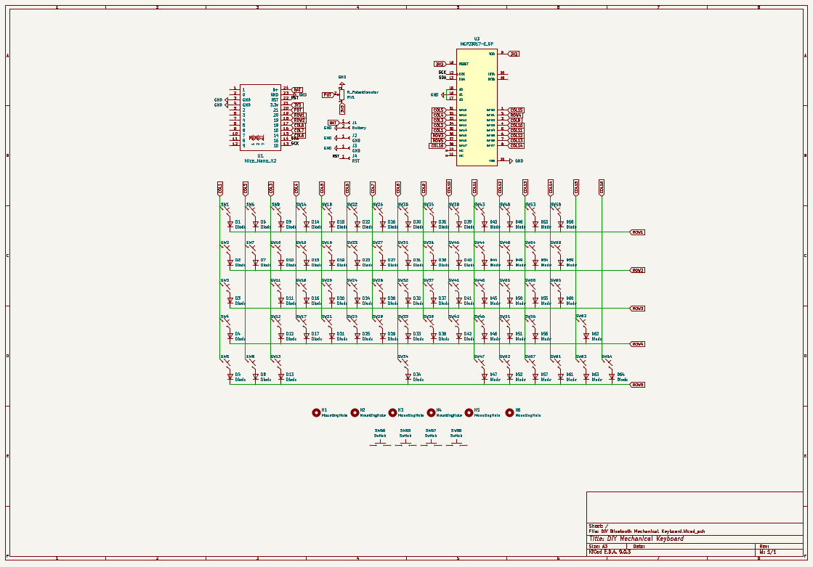

# DIY Bluetooth Mechanical Keyboard
---
Author: "Rainier Pearson Saputra"
Created at: "2025-07-11"

---

**Total Time Spent: 30 hours**

---

# July 11 – Planning, BOM, and Schematics

I started this project by planning what I actually wanted out of the keyboard. I knew it had to be wireless, compact, and clean-looking, but I also wanted a few uncommon features like a slide potentiometer for volume and passive NFC tags for automations. I decided early on that this would be a 60% layout without a function row, and everything had to be rechargeable over USB Type-C.

After deciding on the features, I began selecting components and building the initial BOM. I browsed Tokopedia to find all the parts I needed. I went with Gateron Milky Yellows, a Nice!Nano V2 for wireless support, hot-swap sockets, and a JST connector for the battery. I also chose EVA foam for sound dampening and rubber feet for anti-slip.

Once I was done with part selection and BOM creation, I moved into KiCad and created the schematic. I designed a 5 by 16 keyboard matrix and wired everything up to the Nice!Nano. With the schematic complete and everything properly labeled, I was ready to move on to PCB layout the next day.

* **Image:** 

* **Time Spent: 4.5 hours**

---

# July 12 – PCB Design and Routing

Today was mostly spent inside KiCad. I started by assigning all the footprints to their symbols and laying out the matrix on the PCB. I spent a long time positioning the switches and tracks to make sure everything fits nicely.

After that I routed the power lines and connected everything to the Nice!Nano. I also added a JST connector footprint, screw mounting holes, and some basic silkscreen labels to help with assembly.

* **Image:** 

* **Time Spent: 9 hours**

---

# July 13 – Case Design (CAD)

With the STEP export of the PCB ready, I opened Fusion 360 and started designing the case. The concept was to make it minimalist and clean, with no visible screws on the outside and an inclined base that is ergonomic and comfortable for long typing sessions. 

On the inside, I designed clearance around the USB port, slide potentiometer, and created the standoffs for screw mount.

* **Image:** 

* **Time Spent: 6.5 hours**

---

# July 14 – Switch and Detail Modeling

Today was mostly focused on adding in switch models and checking component fittings. I did this because I fear that some components won't fit nicely on the final build.

I also designed small pockets inside the walls of the case for passive NFC tags, and finalized how the detachable wrist rest would mount.

* **Image:** 

* **Time Spent: 5 hours**

---

# July 15 – Final Polish and Repo Upload

I spent the day finishing everything off. In Fusion 360 I added the wrist rest, then exported the case, wristrest, and the full assembly as STEP. 

Once all the files were ready, I organized everything into a GitHub repo. I uploaded the BOM, CAD models, KiCad PCB files, and my journal file. Now it's all ready to be submitted.

* **Image:** 

* **Time Spent: 5 hours**
